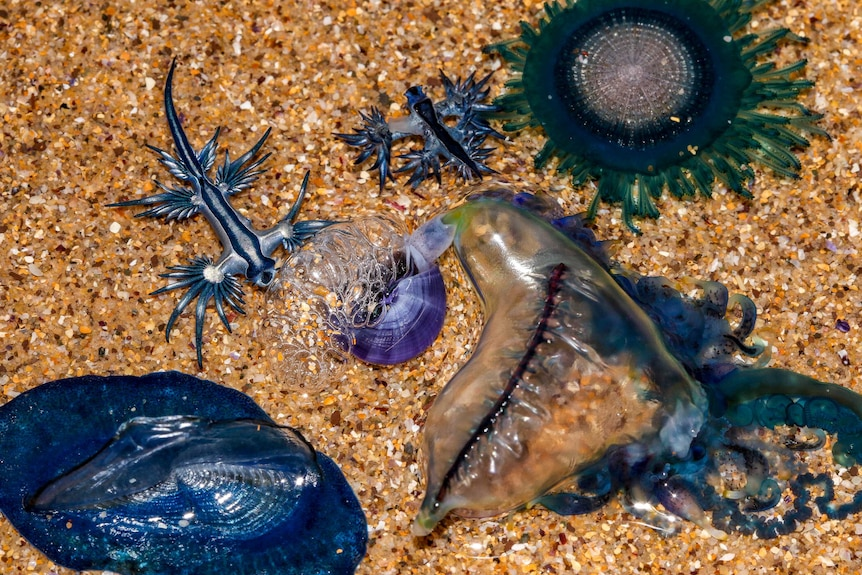

```{r setup, include=FALSE}
knitr::opts_chunk$set(echo = TRUE, incl = T)

```

# 1. Introduction

I have two simple questions:
- Do different animals of the blue fleet have differential probabilities of wind and current driven beaching?

- Investigate this by comparing beaching metrics for different groups for varying wind and current speeds.
- we also perform one model screen where wind direction changes over time.

- Do ecological interactions impact the probability of beaching? 

# 2. Model Elaboration

## 2.1 Conceptual Overview
<p align="justify">
The model is designed to investigate the effects of physical factors such as wind and ocean currents on the movement and behavior of the two species. We created a 50km x 10km grid, with a spatial resolution of 1 meter (5*10^9 total cells). Cells with x-values > 1km were assigned a 'land' status and all other cells where assigned an 'ocean' status. This resulted in a straight coastline stretching the left side of the grid, emulating the Eastern Australian Coastline. Each individual cell was then assigned a value for the following physical parameters: Wind Speed, Wind Direction, Current Speed, Current Direction. The temporal resolution was 1 hour. Thus, all speed parameters are in km/H, and each iteration represents 1 hour in real-time.

The environment was then populated with individual Glaucus and Physalia, each with their own unique attributes. For glaucus, we assigned the following attributes: initial X coordinate, initial Y coordinate, chemodetection range, and movement speed. As both chemodetection and speed are traits that are expected to vary between Glaucus, these were assigned by drawing one value from a normal distribution with mean = LITERATURE and sd = LITERATURE. Individual Glaucus could end up beached or alive at the end of the simulation. For Physalia, the following attributes were assigned: initial X coordinate, initial Y coordinate and orientation. Orientation refers to the position of the sail relative to the tentacles: this comes in a 'right-handed' or 'left-handed' variation. This variable was assigned randomly for each individual. Individual physalia could end up beached, eaten, or alive at the end of the simulation.

Whilst grid resolution was 1m, our model allows individuals to move through continuous space. The movement of an individual depends on the winds and current within the current cell, however the effect of these drivers might only amount to a movement of 20 cm within a timestep. This value is used to update the position of the individual. On the next iteration, the individual will simply 'feel' the same physical drivers, as it still finds itself in the same cell. This enables us to include the biological interactions that occur on the scale of centimeters. 


</p>

## 2.2 Movement Equations

\n

### 2.2.1 Glaucus atlanticus
$$
X_{j,i+1} = X_{ij} + WindSpeed_{{xy,i}} * sin(WindDirection_{xy,i}) + CurrentSpeed_{xy,i} * sin(CurrentDirection_{xy,i}) + C * (GlaucusSpeed_{ij} * sin(atan(Y_{Prey} - Y_i, X_{Prey} - X_i)))
$$
$$
Y_{j,i+1} = Y_{ij} + WindSpeed_{{xy,i}} * cos(WindDirection_{xy,i}) + CurrentSpeed_{xy,i} * cos(CurrentDirection_{xy,i}) + C * (GlaucusSpeed_{ij} * cos(atan(Y_{Prey} - Y_{ij}, X_{Prey} - X_{ij} )) )
$$
***Where:*** 

$$
X_{j,i+1} = \text{Position}\,\text{along}\,\text{the}\,\text{East-West}\,\text{Axis for}\,Individual_{j }\text{ at}\,\text{Time = }\,i+1 \\
X_{ij} = \text{Position}\,\text{along}\,\text{the}\,\text{East-West}\,\text{Axis for}\,Individual_{j }\text{ at}\,\text{Time = }\,i \\
Y_{j,i+1} = \text{Position}\,\text{along}\,\text{the}\,\text{North-South}\,\text{Axis for}\,Individual_{j }\text{ at}\,\text{Time = }\,i+1 \\
Y_{ij} = \text{Position}\,\text{along}\,\text{the}\,\text{North-South}\,\text{Axis for}\,Individual_{j }\text{ at}\,\text{Time = }\,i \\
WindSpeed_{xy,i} = \text{Wind Speed}\,\text{in}\, cell_{X_i,Y_i},\text{at}\,\text{Time = }\,i \\
WindDirection_{xy,i} = \text{Wind Direction}\,\text{in}\, cell_{X_i,Y_i},\text{at}\,\text{Time = }\,i \\
CurrentSpeed_{xy,i} = \text{Current Speed}\,\text{in}\, cell_{X_i,Y_i},\text{at}\,\text{Time = }\,i \\
CurrentDirection_{xy,i} = \text{Current Direction}\,\text{in}\, cell_{X_i,Y_i},\text{at}\,\text{Time = }\,i \\
GlaucusSpeed_{i,j} = \text{Swimming Speed}\,\text{for}\, Individual_{j }\text{ at}\,\text{Time = }\,i \\
Y_{prey} = \text{Y coordinate of closest prey for}\, Individual_{j } \text{ at Time = } i \\
X_{prey} = \text{X coordinate of closest prey for}\, Individual_{j } \text{ at Time = } i \\
Prey = ∀Physalia \\
C = \begin{cases}
1, & \text{if Prey within } Detection Range_j \\
0, & \text{if Prey beyond } Detection Range_j
\end{cases}
$$

<p align="justify">
The movement of Glaucus atlanticus depends on physical and biological parameters. For iteration i of the model, the position of an individual is given by the x and y coordinate. The displacement between time = i and time = i + 1 is given by above equations. The effects of winds and current depend on i) the speed in km/h and ii) the direction in radians. Sin(direction) then gives vertical (north-south) displacement, whilst cos(direction) gives horizontal (east-west). To illustrate, if wind is blowing from the east, direction equals 1.5 * pi. Displacement can then be calculated as:
</p>

$$
\Delta_{x} = sin(1.5 * pi) * speed = -1*speed \\
\Delta_{y} = cos(1.5*pi) = 0 \\
\text{Thus, wind from the east will move an individual to the west}
$$

<p align="justify">
In addition, we allow Glaucus to make small directed movements towards prey, if their prey is within a certain 'detection zone'. The size of this detection zone depends on the chemodetection abilities of an individual glaucus. If a prey item is within the zone, we calculate the angle in radians between the predator and the prey, and multiply this new direction by the speed of that particular glaucus. The glaucus will always move to the closest prey item it detects.
</p>

```{r GA Movement, eval = F, incl = T}
# Movement of Glaucus
glaucusMovement <- function(glaucus, physalia){
  
  # Check the glaucus is not beached
  if(glaucus$x > 1){
    glaucus$col <- 'steelblue'
    
    
    ### Predator module
    
    # Glaucus are predators. They can detect prey from distance using chemical cues. We want to simulate these capabilities
    # by allowing glaucus limited movement to a target, if the target is within reasonable range.
    
    # scan area for each glaucus
    # Convert to spatial geometries to allow geometric operations.
    spat.point <- st_point(c(glaucus$x, glaucus$y))
    
    # We can decide what a reasonable buffer is. This might be a parameter tied to the 
    # individual Glaucus!
    detection.zone <- st_buffer(spat.point, glaucus$chemodetection)

    # Find the Physalia that are within the detection zone.
    # needs to be in df format!!!1 vectorise all at once.
    
    physalia.df <- rbindlist(physalia, fill = T)
    
    physalia.df.spat <- st_as_sf(physalia.df , coords = c('x', 'y'))
    
    # Any prey in the detection zone?
    if(any(st_intersects(physalia.df.spat, detection.zone, sparse = F))){
      # Find the nearest Physalia
      print('Attack!')
      glaucus.target <- physalia.df.spat[[st_nearest_feature(spat.point, physalia.df.spat),'geometry']]
      # Now make it move towards the target. We want to use a random walk-esque
      # movement with bias towards the physalia.
      
      target_angle <- atan2(glaucus.target[2] - glaucus$y, glaucus.target[1] - glaucus$x) # atan2 calculates the angle to get from y to x
      glaucus$x <- glaucus$x + glaucus$speed * sin(target_angle)
      glaucus$y <- glaucus$y +  glaucus$speed * cos(target_angle)
      
    }

  
    # Now account for effect of current and wind on glaucus.  
    
    # Positional update rules: this IS the movement of a Glaucus
    glaucus$x <- max(glaucus$x + 0.005*wind_strength[round(glaucus$x,digits = 2), 
                                               round(glaucus$y, digits = 2)] * sin(wind_direction[round(glaucus$x,digits = 2), 
                                                                                                  round(glaucus$y, digits = 2)]) +
                       current_strength[round(glaucus$x,digits = 2), 
                                        round(glaucus$y, digits = 2)] * sin(current_direction[round(glaucus$x,digits = 2), 
                                                                                              round(glaucus$y, digits = 2)]),0)
    
    # Y movement (north - south) uses cosine function
    glaucus$y <- max(glaucus$y + 0.005*wind_strength[round(glaucus$x,digits = 2), 
                                               round(glaucus$y, digits = 2)] * cos(wind_direction[round(glaucus$x,digits = 2), 
                                                                                                  round(glaucus$y, digits = 2)]) +
                       current_strength[round(glaucus$x,digits = 2), 
                                        round(glaucus$y, digits = 2)] * cos(current_direction[round(glaucus$x,digits = 2), 
                                                                                              round(glaucus$y, digits = 2)]),0)
    
  } else{
    glaucus$col <- 'red'
    glaucus$status <- 'BEACHED' # status 1 is beached
  }
  return(glaucus)
}
```
<br>

### 2.2.2 Physalia physalis
$$
X_{j,i+1} = X_{ij} + 0.0266*(WindSpeed_{{xy,i}} * sin(WindDirection_{xy,i}+ D_{ij})) + CurrentSpeed_{xy,i} * sin(CurrentDirection_{xy,i}) \\
Y_{j,i+1} = Y_{ij} + 0.0266*(WindSpeed_{{xy,i}} * cos(WindDirection_{xy,i}+ D_{ij})) + CurrentSpeed_{xy,i} * cos(CurrentDirection_{xy,i})
$$
***Where:*** 
$$
X_{j,i+1} = \text{Position}\,\text{along}\,\text{the}\,\text{East-West}\,\text{Axis for}\,Individual_{j }\text{ at}\,\text{Time = }\,i+1 \\
X_{ij} = \text{Position}\,\text{along}\,\text{the}\,\text{East-West}\,\text{Axis for}\,Individual_{j }\text{ at}\,\text{Time = }\,i \\
Y_{j,i+1} = \text{Position}\,\text{along}\,\text{the}\,\text{North-South}\,\text{Axis for}\,Individual_{j }\text{ at}\,\text{Time = }\,i+1 \\
Y_{ij} = \text{Position}\,\text{along}\,\text{the}\,\text{North-South}\,\text{Axis for}\,Individual_{j }\text{ at}\,\text{Time = }\,i \\
WindSpeed_{xy,i} = \text{Wind Speed}\,\text{in}\, cell_{X_i,Y_i},\text{at}\,\text{Time = }\,i \\
WindDirection_{xy,i} = \text{Wind Direction}\,\text{in}\, cell_{X_i,Y_i},\text{at}\,\text{Time = }\,i \\
CurrentSpeed_{xy,i} = \text{Current Speed}\,\text{in}\, cell_{X_i,Y_i},\text{at}\,\text{Time = }\,i \\
CurrentDirection_{xy,i} = \text{Current Direction}\,\text{in}\, cell_{X_i,Y_i},\text{at}\,\text{Time = }\,i \\
D_{ij} = \begin{cases}
normal(pi/3, 0.1) & \text{if Orientation}_j = Right \\
normal(-pi/3,0.1) & \text{if Orientation}_j = Left
\end{cases} \text{at Time = } i \\
Orientation_j = \text{Sail Orientation of Individual}_j \text{ at Time = } i
$$

Physalia moves at ~2.66% the speed of the wind (REF). Left-sailed individuals will be pushed in a direction 50 degrees to the left of the prevailing wind, whilst right handed individuals move 50 degrees to the right of prevailing winds. The effect of currents on physalia is described using the same equations as for Glaucus.
```{r PP Movement, eval=F, include=TRUE}
# Movement of Physalia
physaliaMovement <- function(physalia, glaucus){
  
  # Boundary conditions for movement
  if(physalia$x >= 100 | physalia$y >= 100 | physalia$y <= 0){ 
    physalia$col <- 'green' 
    physalia$status <- 2
    return(physalia)}
  
  # Live condition
    if(physalia$x > 1 & physalia$status != 'EATEN'){
    physalia$col <- 'purple'
    
    # This is a very important part. We have right and left=handed bluebottles
    # They drift in opposite directions - presumably to sustain populations.
    # We need to account for this properly. In addition, we want to add some
    # stochasticity to the movement. This is due to inherent variability
    # in the shape and size of bluebottles, but also due to waves etc.
    
    if(physalia$orientation == 'right') {direction_offset <- rnorm(1,1,0.1)*pi/3} # right-handed drift at 50 degrees from wind direction.
    if(physalia$orientation == 'left') {direction_offset <- rnorm(1,-1,0.1)*pi/3} # left handed drift at

    # Positional update rules: this IS the movement of physalia
    # Wind larger impact on physalia due to sail
    # physalia also have an offset - their sails change the way they interact
    # with wind - this is one of the cool parts in the model.
    # 0.0266 - see Lee, Schaeffer, Groeskamp (2021)
    physalia$x <- max(physalia$x + 0.0266*(wind_strength[round(physalia$x,digits = 2), 
                                                   round(physalia$y, digits = 2)]) * sin(wind_direction[round(physalia$x,digits = 2), 
                                                                                                       round(physalia$y, digits = 2)]+ direction_offset) +
                      current_strength[round(physalia$x,digits = 2), 
                                         round(physalia$y, digits = 2)] * sin(current_direction[round(physalia$x,digits = 2), 
                                                                                                round(physalia$y, digits = 2)]),0)
    
    # Y movement (north - south) uses cosine function
    physalia$y <- max(physalia$y + 0.0266*(wind_strength[round(physalia$x,digits = 2), 
                                                   round(physalia$y, digits = 2)]) * cos(wind_direction[round(physalia$x,digits = 2), 
                                                                                                       round(physalia$y, digits = 2)] + direction_offset) +
                       current_strength[round(physalia$x,digits = 2), 
                                         round(physalia$y, digits = 2)] * cos(current_direction[round(physalia$x,digits = 2), 
                                                                                                round(physalia$y, digits = 2)]),0)
    
    ### Predator module
    
    # We want to simulate damage to the physalia, i.e. being killed by a predator.
    # We use a simple rule: if the glaucus is within feeding range of the physalai
    # for 3 timesteps, the physalia has been eaten completely. The glaucus will then also
    # move on as we delete the physalia. 
    
    # Convert to spatial geometries to allow geometric operations.
    spat.point <- st_point(c(physalia$x, physalia$y))
    
    # We can decide what a reasonable buffer is. This is the same for
    # all physalia. 50 cm seems reasonable
    under.attack.zone <- st_buffer(spat.point, 0.0005)
    
    # Check if there is a predator nearby
    glaucus.df <- rbindlist(glaucus, fill = T)
    glaucus.df.spat <- st_as_sf(glaucus.df , coords = c('x', 'y'))
    
    # Any predators in the detection zone?
    if(any(st_intersects(glaucus.df.spat, under.attack.zone, sparse = F))){
      # If yes, the physalia is 'under attack'
      physalia$underattack <- physalia$underattack + 1
    }
    
    if(physalia$underattack >= 3){
      physalia$status <- 'EATEN'
    }
    
  } else{
    physalia$col <- 'red'
    if(physalia$x < 1){
      physalia$status <- 'BEACHED' # status 1 is beached
    }
  }
  return(physalia)
}

```


### 2.3 Biological Interactions
<p align="justify">
Both Physalia and Glaucus are allowed to interact with each other in our model, and this affects their movements. Glaucus will seek out nearby physalia as described in section 2.2.1. However, they may also 'latch' on to a physalia. This emulates feeding behaviour in which Glaucus move within the tentacles of a physalia: Glaucus may then move with the physalia, until it stops feeding or completely depletes the resource. Consequently, the time it takes to deplete the resource equals the time it takes for a Physalia to be killed. We assume that an individual physalia cannot survive unlimited attacks by Glaucus, and thus an individual that spends more than REF X hours 'under attack' will be assigned the status 'EATEN' and no further movements are simulated. Any Glaucus that was 'latched on' to the deceased prey, or one that simply stops feeding, then reverts to their regular movement equations. 
</p>

# 3. Model Simulation and Parameter Screening

## 3.1 Simulation Function
```{r FullSim, eval=F, include=TRUE}
# Main function that runs the simulation
simBlueFleet <- function(nTimes,n_rows, n_cols, nPhysalia, nGlaucus,
                         strength_current, strength_wind,
                         dir_wind, dir_current,
                         glaucus_Chemodetection, glaucus_Speed, iniSpace){
  
  # Assign wind and current speed and direction to each grid cell.
  # Based on param input
  current_strength <- matrix(rep(strength_current,n_rows*n_cols), 
                              nrow=n_rows)
  wind_strength <- matrix(rep(strength_wind,n_rows*n_cols), 
                           nrow=n_rows)
  
  # Wind and current directions
  
  wind_direction <- matrix(rep(dir_wind, n_rows*n_cols), 
                            nrow=n_rows, ncol=n_cols)
  current_direction <- matrix(rep(dir_current, n_rows*n_cols), 
                               nrow=n_rows, ncol=n_cols)
  
  
  ### Instantiate model agents
  
  # Glaucus atlanticus individuals
  print('Generating animals')
  # Our individuals also have attributes. Glaucus are our predators.
  # They will seek out Physalia, and are capable of (very limited)
  # powered movement. 
  
  glaucus <- list()
  for (i in 1:nGlaucus) {
    glaucus[[i]] <- list(
      x = round(runif(1, iniSpace$xmin, iniSpace$xmax), digits = 0),
      y = round(runif(1,iniSpace$ymin, iniSpace$ymax),digits = 0),
      chemodetection = glaucus_Chemodetection, 
      speed = rnorm(1,glaucus_Speed, sd = glaucus_Speed/4),
      status = 'ALIVE'
    )
  }
  
  # Set up bluebottle movement and functions. Bluebottles can be right
  # or left handed.
  physalia <- list()
  for (i in 1:nPhysalia) {
    physalia[[i]] <- list(
      x = round(runif(1, iniSpace$xmin, iniSpace$xmax), digits = 0),
      y = round(runif(1, iniSpace$ymin, iniSpace$ymax),digits = 0),
      underattack = 0,
      status = 'ALIVE',
      orientation = sample(c('left', 'right'),1)
    )
  }
  
  print('Simulating Dynamics')
  GlaucusSim <- list()
  PhysaliaSim <- list()

  # Run model over nTimes steps.
  for (i in 1:nTimes){

    # Update Physalia movement
    for(k in 1:nPhysalia){
      
      # This function updates the position of all simulated
      # Physalia. Also tracks their 'status', which may be one
      # of 'ALIVE', 'BEACHED', or 'EATEN'.
      physalia[[k]] <- physaliaMovement(physalia[[k]], glaucus)
    }

    PhysaliaSim[[i]] <- rbindlist(physalia)
    
    
    # Update Glaucus movement. Status includes 'BEACHED' or 'ALIVE'.
    for(j in 1:nGlaucus){
      glaucus[[j]] <- glaucusMovement(glaucus[[j]], physalia)
      
    }
    GlaucusSim[[i]] <- rbindlist(glaucus)
  }
  simResults <- list('GlaucusStats' = GlaucusSim,
                     'PhysaliaSim' = PhysaliaSim)
  return(simResults)
}

```
## 3.2 Bash Script for Parameter Screening
```{bash ParScreen, eval=F, include=TRUE}
touch

```
# 4. Results

# 5. Conclusion

# 6. References


